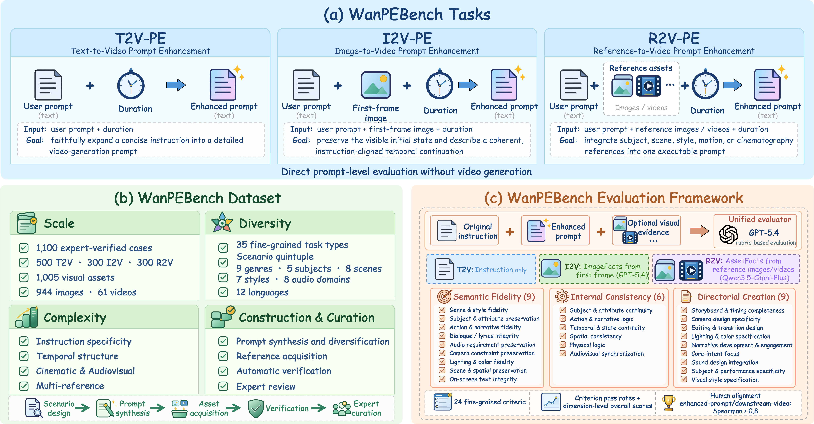
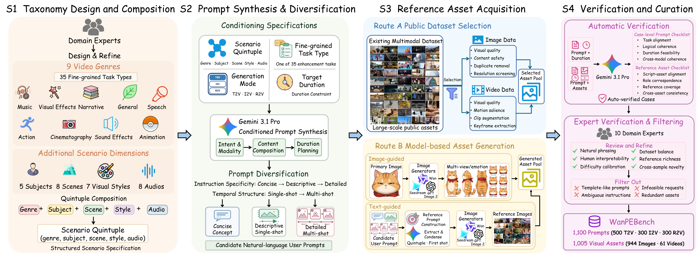
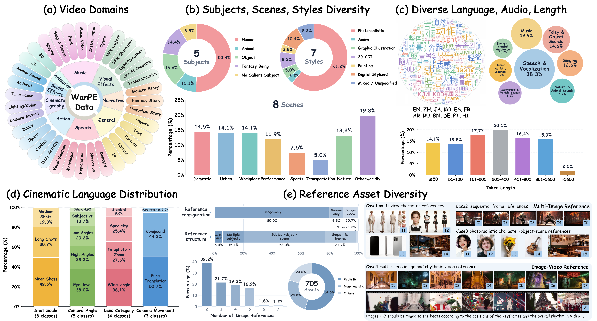
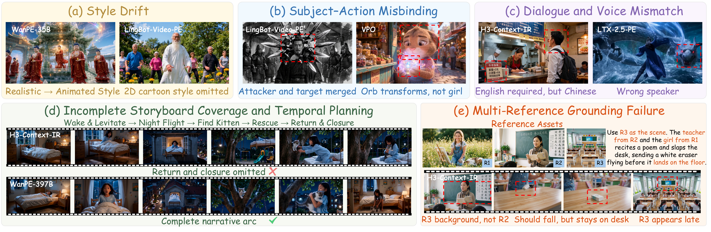

# Towards Unified Evaluation of Prompt Enhancers for Video Generation

## ✅ TODO List

 - [x] Prompt data & Reference assets
 - [ ] Evaluation code

## 💡 Overview

<p align="center">
    
</p>

## 🏗️ Data Construction Pipeline

<p align="center">
    
</p>

## 📊 Data Statistics and Diversity

<p align="center">
    
</p>

## 🔍 Qualitative Failure Cases

<p align="center">
    
</p>

## 🌟 Citation

If you find this code useful for your research, please cite our paper:

```
@article{PEBench,
  title={Towards Unified Evaluation of Prompt Enhancers for Video Generation},
  author={Shao, Yawen and Zhu, Yubo and Dai, Ziyun and Fang, Zixun and Zhu, Kai and Jiang, Zeyinzi and Ai, Yufeng and Sun, Siyang and Xue, Haolan and Shang, Yu and Bao, Yuxiang and Bi, Zoubin and Luo, Jingming and Xiao, Jie and Mao, Chaojie and Kan, Zhehan and Luo, Hongchen and Liu, Yu and Zhong, Sheng and Tong, Wei and Fu, Xueyang and Cao, Yang and Zhai, Wei and Zha, Zheng-Jun},
  journal={arXiv preprint arXiv:2610.xxxxx},
  year={2026}
}
```
